# 🎯 مخططات تدفق منصة SmartDine SaaS

## 📋 جدول المحتويات
1. [التدفق العام للمنصة](#التدفق-العام-للمنصة)
2. [تدفق تسجيل المطعم](#تدفق-تسجيل-المطعم)
3. [تدفق طلب العميل](#تدفق-طلب-العميل)
4. [تدفق معالجة الطلب](#تدفق-معالجة-الطلب)
5. [تدفق مساعد AI](#تدفق-مساعد-ai)
6. [تدفق AR Viewer](#تدفق-ar-viewer)
7. [تدفق إدارة القائمة](#تدفق-إدارة-القائمة)
8. [تدفق الدفع والاشتراك](#تدفق-الدفع-والاشتراك)
9. [بنية النظام الكاملة](#بنية-النظام-الكاملة)

---

## 1️⃣ التدفق العام للمنصة

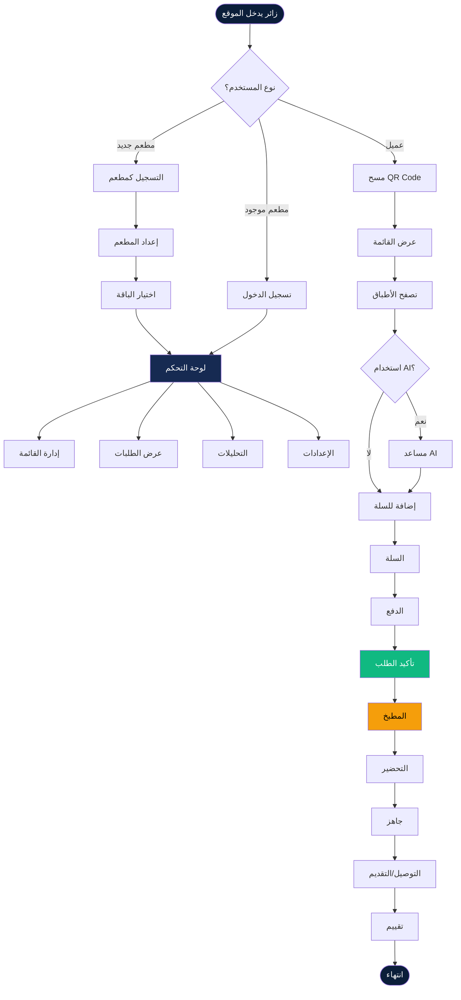

---

## 2️⃣ تدفق تسجيل المطعم

```mermaid
graph LR
    A([البداية]) --> B[زيارة الموقع]
    B --> C[الضغط على 'ابدأ الآن']
    C --> D{لديه حساب؟}
    
    D -->|نعم| E[تسجيل الدخول]
    D -->|لا| F[ملء نموذج التسجيل]
    
    F --> G[إدخال معلومات المطعم]
    G --> H[رفع الشعار]
    H --> I[اختيار الباقة]
    
    I --> J{نوع الباقة؟}
    J -->|Basic| K[29$/شهر]
    J -->|Pro| L[79$/شهر]
    J -->|Enterprise| M[199$/شهر]
    
    K --> N[إدخال بيانات الدفع]
    L --> N
    M --> N
    
    N --> O[تأكيد الدفع]
    O --> P{الدفع ناجح؟}
    
    P -->|نعم| Q[تفعيل الحساب]
    P -->|لا| N
    
    Q --> R[إرسال بريد ترحيبي]
    R --> S[الدخول للوحة التحكم]
    
    E --> S
    
    S --> T[جولة تعريفية]
    T --> U[إضافة القائمة]
    U --> V[طباعة QR Codes]
    V --> W([جاهز للاستخدام])
    
    style A fill:#0B1E3A,color:#fff
    style W fill:#10B981,color:#fff
    style Q fill:#10B981,color:#fff
```

---

## 3️⃣ تدفق طلب العميل (Customer Order Flow)

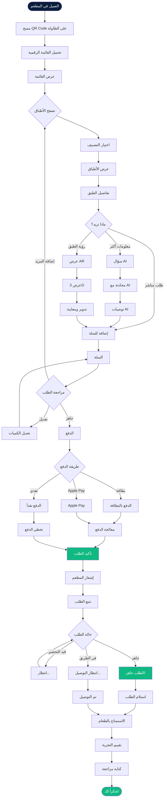

---

## 4️⃣ تدفق معالجة الطلب (Order Processing)

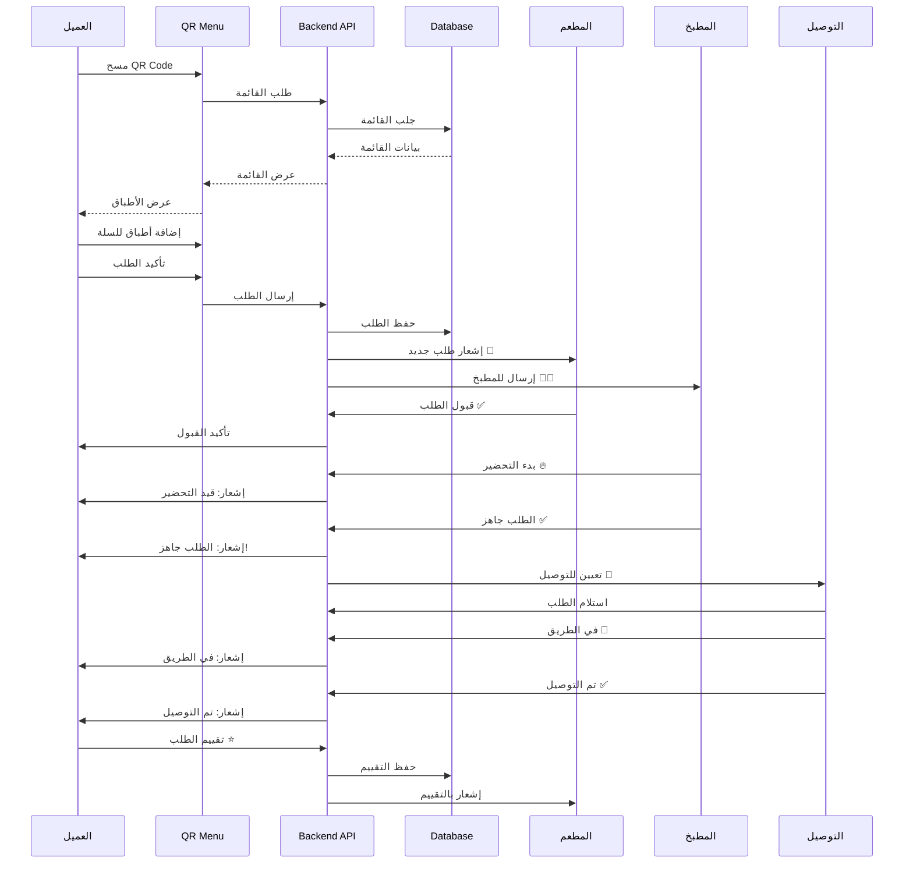

---

## 5️⃣ تدفق مساعد AI (AI Assistant Flow)

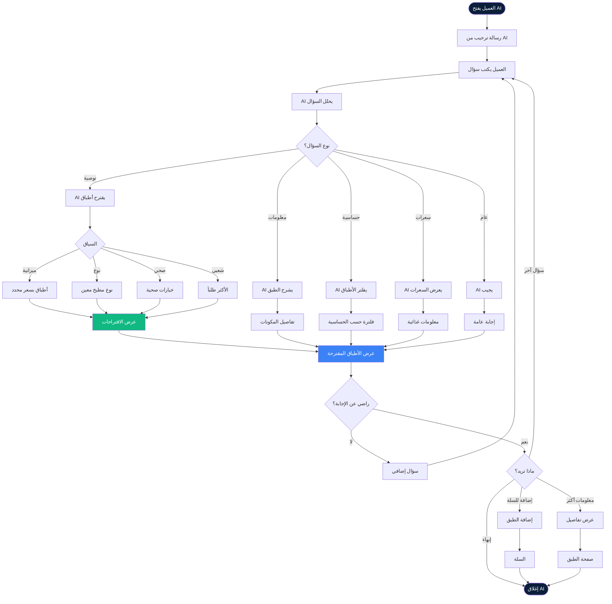

---

## 6️⃣ تدفق AR Viewer (AR Experience Flow)

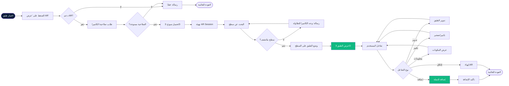

---

## 7️⃣ تدفق إدارة القائمة (Menu Management)

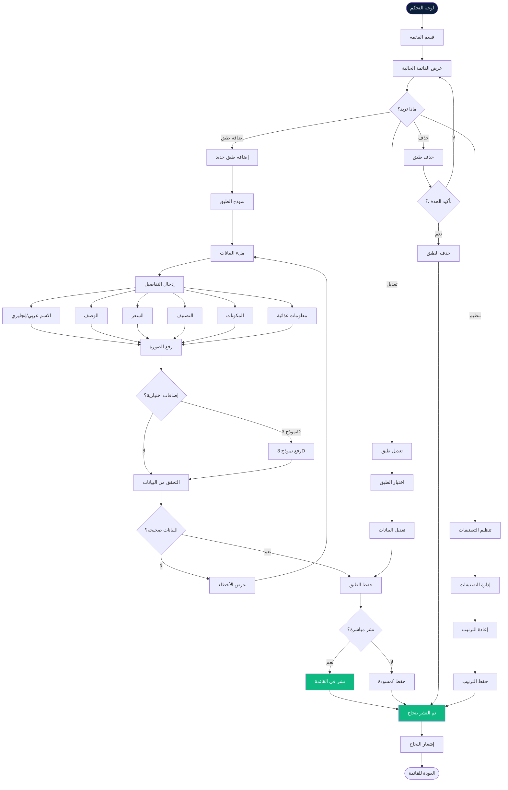

---

## 8️⃣ تدفق الدفع والاشتراك (Payment & Subscription)

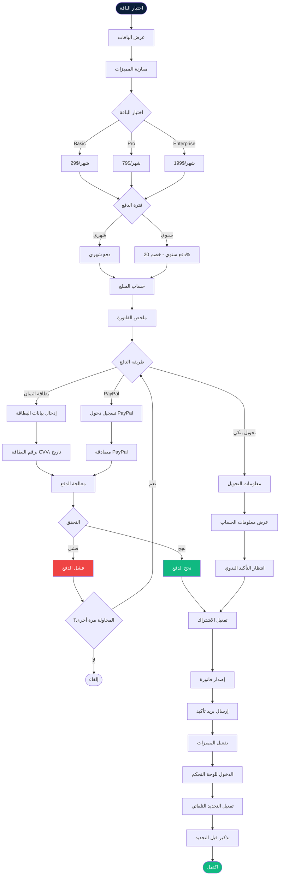

---

## 9️⃣ بنية النظام الكاملة (System Architecture)

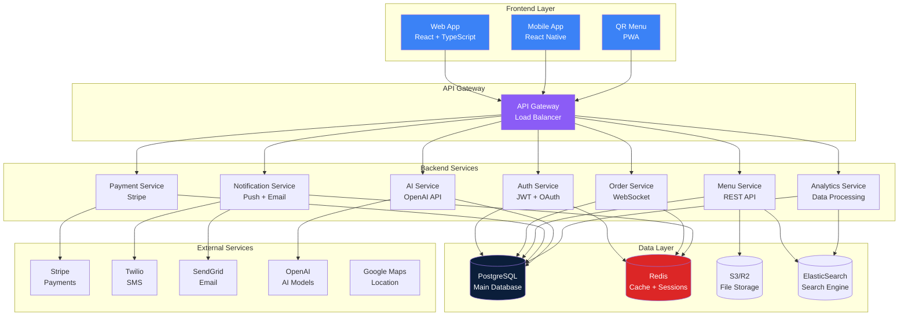

---

## 🔟 تدفق لوحة التحكم (Dashboard Flow)

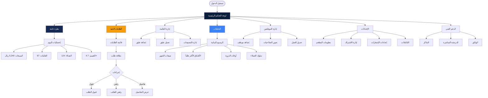

---

## 1️⃣1️⃣ تدفق المطبخ (Kitchen Dashboard Flow)

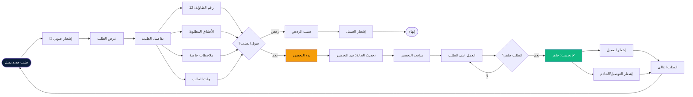

---

## 1️⃣2️⃣ تدفق التوصيل (Delivery Flow)

```mermaid
graph TB
    Start([طلب جاهز للتوصيل]) --> Assign[تعيين للسائق]
    Assign --> Notify[إشعار السائق]
    
    Notify --> Accept{قبول السائق؟}
    Accept -->|لا| Reassign[إعادة التعيين]
    Accept -->|نعم| Pickup[التوجه للمطعم]
    
    Reassign --> Assign
    
    Pickup --> Arrived[الوصول للمطعم]
    Arrived --> Collect[استلام الطلب]
    Collect --> Verify[التحقق من الطلب]
    
    Verify --> Complete{الطلب كامل؟}
    Complete -->|لا| Report[الإبلاغ عن مشكلة]
    Complete -->|نعم| StartDelivery[بدء التوصيل]
    
    Report --> Resolve[حل المشكلة]
    Resolve --> StartDelivery
    
    StartDelivery --> Navigate[التنقل للعنوان]
    Navigate --> GPS[تتبع GPS]
    GPS --> UpdateLocation[تحديث الموقع]
    
    UpdateLocation --> CustomerNotify[إشعار العميل بالموقع]
    CustomerNotify --> Approaching[الاقتراب من الوجهة]
    
    Approaching --> ArrivedCustomer[الوصول للعميل]
    ArrivedCustomer --> Contact[الاتصال بالعميل]
    
    Contact --> Handover[تسليم الطلب]
    Handover --> Confirm[تأكيد الاستلام]
    
    Confirm --> Payment{الدفع نقداً؟}
    Payment -->|نعم| CollectCash[تحصيل المبلغ]
    Payment -->|لا| Skip[تخطي]
    
    CollectCash --> Complete2[إكمال التوصيل]
    Skip --> Complete2
    
    Complete2 --> Rate[طلب تقييم]
    Rate --> Photo[التقاط صورة التسليم]
    Photo --> Submit[إرسال التأكيد]
    
    Submit --> NextOrder{طلب آخر؟}
    NextOrder -->|نعم| Start
    NextOrder -->|لا| End([إنهاء الوردية])
    
    style Start fill:#0B1E3A,color:#fff
    style StartDelivery fill:#F59E0B,color:#000
    style Complete2 fill:#10B981,color:#fff
    style End fill:#0B1E3A,color:#fff
```

---

## 1️⃣3️⃣ تدفق التقييمات (Rating & Review Flow)

```mermaid
graph LR
    A([الطلب مكتمل]) --> B[طلب تقييم]
    B --> C{العميل يريد التقييم؟}
    
    C -->|لا| D[تخطي]
    C -->|نعم| E[نموذج التقييم]
    
    D --> Z([إنهاء])
    
    E --> F[تقييم النجوم]
    F --> G[1-5 نجوم]
    
    G --> H{التقييم}
    H -->|1-2 نجوم| I[نموذج تفصيلي]
    H -->|3 نجوم| J[تعليق اختياري]
    H -->|4-5 نجوم| K[شكر + تعليق اختياري]
    
    I --> L[ما المشكلة؟]
    L --> M[اختيار من قائمة]
    M --> N[تفاصيل إضافية]
    
    J --> O[كتابة تعليق]
    K --> O
    N --> O
    
    O --> P[إرسال التقييم]
    P --> Q[حفظ في قاعدة البيانات]
    
    Q --> R[إشعار المطعم]
    R --> S[تحديث متوسط التقييم]
    
    S --> T{تقييم سيء؟}
    T -->|نعم| U[إشعار عاجل للمدير]
    T -->|لا| V[إشعار عادي]
    
    U --> W[رد المطعم]
    V --> W
    
    W --> X[شكر العميل]
    X --> Z
    
    style A fill:#0B1E3A,color:#fff
    style P fill:#10B981,color:#fff
    style U fill:#EF4444,color:#fff
```

---

## 1️⃣4️⃣ خريطة رحلة المستخدم (User Journey Map)

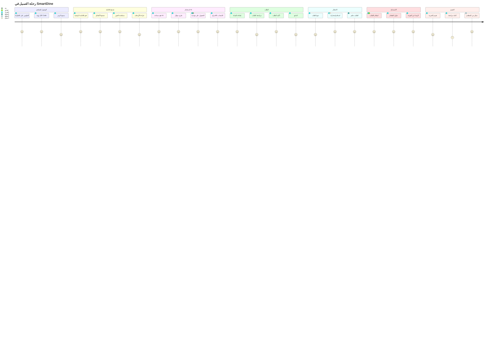

---

## 1️⃣5️⃣ مخطط حالات الطلب (Order State Diagram)

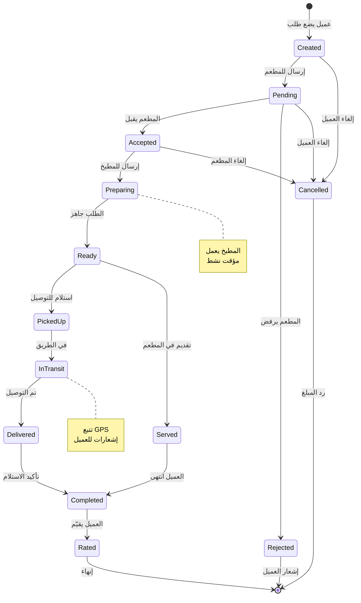

---

## 📊 ملخص المخططات

### المخططات المتوفرة:
1. ✅ **التدفق العام** - نظرة شاملة على المنصة
2. ✅ **تسجيل المطعم** - من التسجيل للتشغيل
3. ✅ **طلب العميل** - رحلة الطلب الكاملة
4. ✅ **معالجة الطلب** - Sequence Diagram
5. ✅ **مساعد AI** - تفاعل الذكاء الاصطناعي
6. ✅ **AR Viewer** - تجربة الواقع المعزز
7. ✅ **إدارة القائمة** - إضافة وتعديل الأطباق
8. ✅ **الدفع والاشتراك** - معالجة المدفوعات
9. ✅ **بنية النظام** - Architecture Overview
10. ✅ **لوحة التحكم** - Dashboard Navigation
11. ✅ **المطبخ** - Kitchen Operations
12. ✅ **التوصيل** - Delivery Process
13. ✅ **التقييمات** - Rating System
14. ✅ **رحلة المستخدم** - User Journey
15. ✅ **حالات الطلب** - State Machine

---

## 🎨 كيفية عرض المخططات

### في GitHub/GitLab
المخططات ستظهر تلقائياً عند عرض الملف

### في VS Code
1. تثبيت إضافة: **Markdown Preview Mermaid Support**
2. فتح الملف والضغط على Preview

### في المتصفح
1. نسخ كود Mermaid
2. الذهاب إلى: https://mermaid.live
3. لصق الكود ومشاهدة المخطط

### تصدير كصور
1. استخدام Mermaid Live Editor
2. تصدير كـ PNG/SVG
3. استخدام في العروض التقديمية

---

## 🔗 روابط مفيدة

- [Mermaid Documentation](https://mermaid.js.org/)
- [Mermaid Live Editor](https://mermaid.live)
- [SmartDine PRD](./src/docs/SmartDine_SaaS_PRD.md)
- [دليل الاستخدام](./SAAS_USAGE_GUIDE.md)

---

*تم إنشاؤه بواسطة: SmartDine Team*  
*آخر تحديث: فبراير 2026*  
*الإصدار: 1.0*
